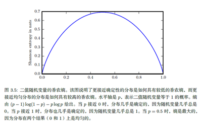
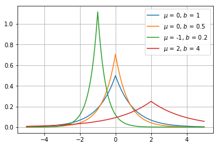
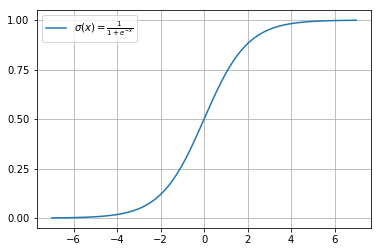
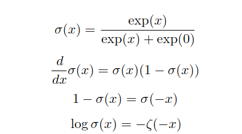
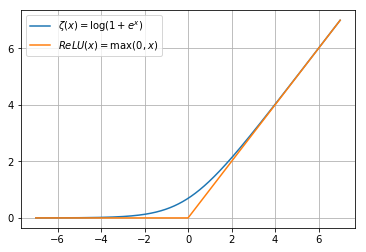
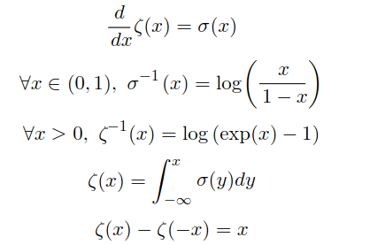
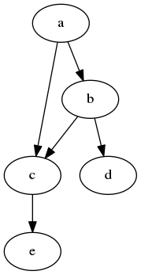
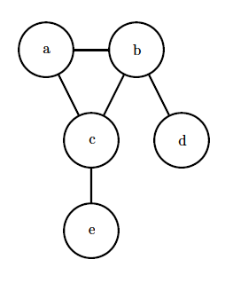

# 概率与信息论

&emsp;&emsp;概率论是用来描述不确定性的数学工具，很多机器学习算都是通过描述样本的概率相关信息来推断或构建模型；信息论最初是研究如何量化一个信号中包含信息的多少，在机器学习中通常利用信息论的一些概念和结论描述不同概率分布之间的关系。

## 1. 基本概念

+ 随机变量: 可以随机取不同值的变量，在机器学习算法中，每个样本的特征取值，标签值都可以看作是一个随机变量，包括离散型随机变量和连续型随机变量。

+ 概率分布: 表示随机变量在每一个可能取到状态下的可能性大小，对于离散型的概率分布，称为概率质量函数(Probability Mass Function, PMF)，对于连续性的变量，其概率分布叫做概率密度函数(Probability Density Function, PDF)。

+ 联合概率分布:　两个或两个以上随机随机变量联合地概率分布情况。

+ 边缘概率: 在知道联合概率分布后，其中某几个变量子集的概率分布被称为边缘概率分布。

+ 条件概率: 在给定某个事件后，其他事件发生的概率，例如在已知今天多云的条件下下雨的概率就是条件概率有，在随机变量$X=x$的条件下$Y=y$的条件概率为$P(Y=y \| X=x) = \frac{P(Y=y,X=x)}{P(X=x)}$。

+ 相互独立: 如果$\forall x \in X, y \in Y, P(X=x,Y=y) = P(X=x)P(Y=y)$，那么就称随机变量Ｘ和Ｙ是相互独立的。

+ 条件独立: 如果$\forall x \in X, y \in Y, z \in Z, P(X=x,Y=y \| Z=z) = P(X=x \| Z=z)P(Y=y \| Z=z)$，那么就称随机变量Ｘ和Ｙ是关于Ｚ相互独立的。

+ 贝叶斯准则: 在已知$P(y \| x)$和$P(x)$的情况下，$P(x \| y)＝\frac{P(x)P(y \| x)}{P(y)}$，贝叶斯准则经常被用在已知参数的先验分布情况下求后验分布。

+ 期望: 函数$f(x)$在某个分布$P(x)$下的平均表现情况，记为$E_{x \sim P}[f(x)]=\int{p(x)f(x)dx}$。

+ 方差: 函数$f(x)$在某个分不下表现的差异性，记为$Var(f(x)=E[(f(x)-E[f(x)])^2]$。

+ 协方差: 两个变量之间线性相关的强度，记为$Cov(f(x),g(x))= E[(f(x)-E[f(x)])(g(x)-E(g(x)))]$。

+ 信息熵（香农熵）: 描述某个概率分布中不确定性的度量，记为$H(x)= -E_{x \sim P}[\log P(x)]$，也记作$H(P)$。

+ KL散度：衡量两个不同概率分布的差异，记作$D_{KL}(P||Q)=E_{x\sim P}[\log\frac{P(x)}{Q(x)}]=E_{x\sim P}[\logP(x)-\logQ(x)]$. 需要注意的是，KL散度非负，所以有些时候被用作不同分布之间的距离。然而它并不是真的距离因为它不是对称的，对于某些$P,Q$，$D_{KL}(P||Q)\neq D_{KL}(Q||P)$。

+ 交叉熵: 与KL散度密切相关的量，它用来描述两个概率分布之间相似度的一个指标，在机器学习中经常使用交叉熵作为分类任务的损失函数，记为$H(P,Q)=H(P)+D_{KL}(P||Q)=-E_{x \sim P}[\log Q(x)]$。

## 2. 常用概率分布

+ 伯努利分布(Bernoulli distribution): 单个二值型变量的分布，例如$P(x=1)=p,P(x=0)=1-p$。

+ Multinoulli分布: 包含k个取值的离散分布，是伯努利分布的扩展。

+ 高斯分布/正态分布(Normal/Gaussian distribution): 自然状态下最常见的分布，概率密度函数为$N(x;\mu,\sigma^2)= \sqrt{\frac{1}{2\pi \sigma^2}} \exp \left ( -\frac{1}{2\sigma^2} (x-\mu)^2 \right)$，形状如下图：

+ 拉普拉斯分布(Laplace distribution)：有着与高斯分布很相近的形式，概率密度函数为$\text{Laplace}(x; \mu, \gamma) = \frac{1}{2\gamma} \exp \left( -\frac{\| x-\mu \|}{\gamma}  \right)$$，形状如下图：

## 3. 一些常用函数

+ Logistic sigmoid函数
  + $\sigma(x) = \frac{1}{1+\exp(-x)}$
  + 函数图像 
  

  + logistic函数有许多重要的性质，通常被用来对数值进行平滑，下面是它的部分性质 
  

+ 线性整流函数(Rectified Linear Unit, ReLU)
  + $ReLU(x) = max(0,x)$
  + 目前神经网络中最常用的一种非线性激活函数

+ Softplus函数
  + $\zeta(x) = \log(1+\exp(x))$
  + softplus函数可以看作是$max(0,x)$的一个平滑，他与ReLU的函数图像如下 
    
  + 它有如下性质 
    

## 4．结构化概率模型

+ 概率图模型: 通过图的概念来表示随机变量之间的概率依赖关系。对应图论中的有向图和无向图概念，概率图模型也分为有向图模型与无向图模型。
+ 下图即为一个关于变量$a,b,c,d,e$之间的有向图模型，

通过该图可以计算$p(a,b,c,d,e)=p(a)p(b \| a)p(c \| a,b)p(d \| b)p(e \| c)$。该图模型使我们能够快速看出此分布的一些性质。例如，a和c直接相互影响，但a和e只有通过c间接相互影响。

+ 无向图模型的因子分解与有向图不同，下图为关于变量$a,b,c,d,e$的无向图模型，

这幅图对应的概率分布可以分解为$p(a,b,c,d,e)=\frac{1}{Z}\psi^{(1)}(a,b,c)\psi^{(2)}(b,d)\psi^{(3)}(c,e)$，通过此图我们也可以看出分布的性质。例如，a和c直接相互影响，但a和e只有通过c间接相互影响。
